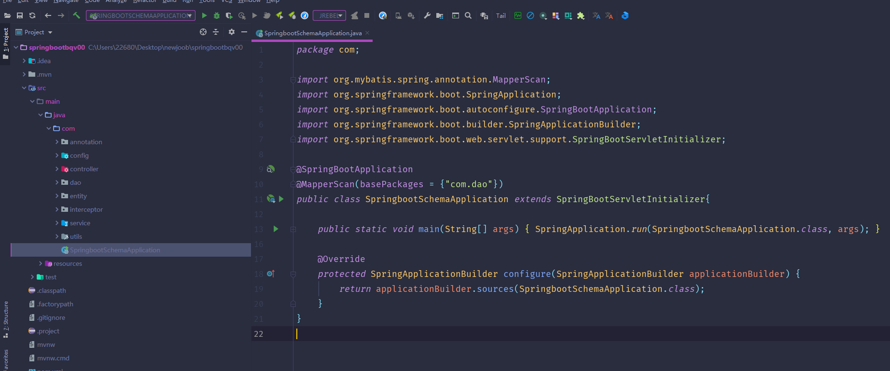
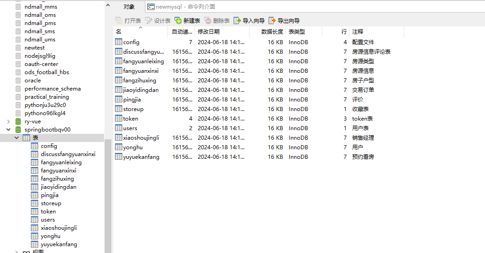
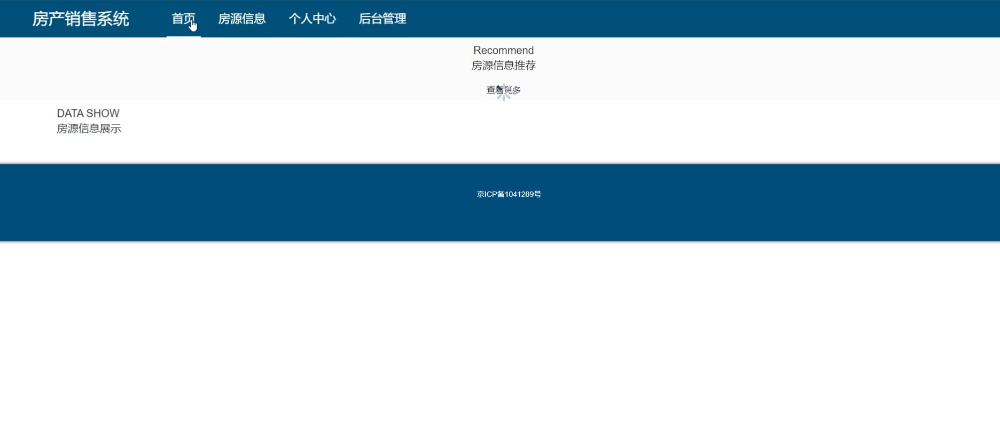
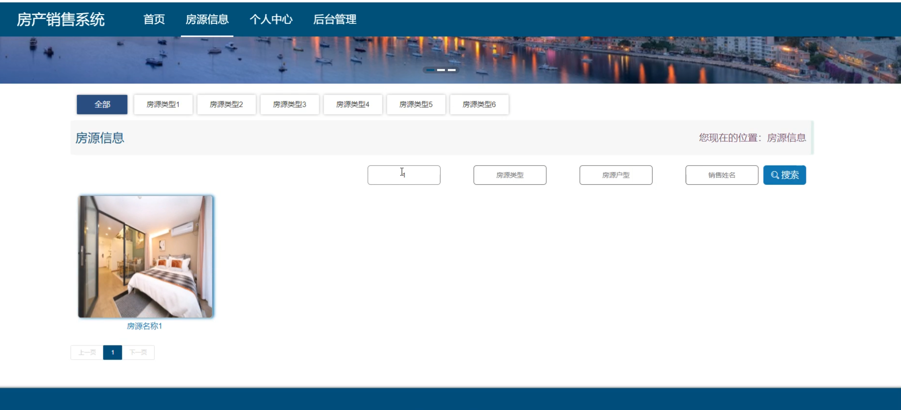
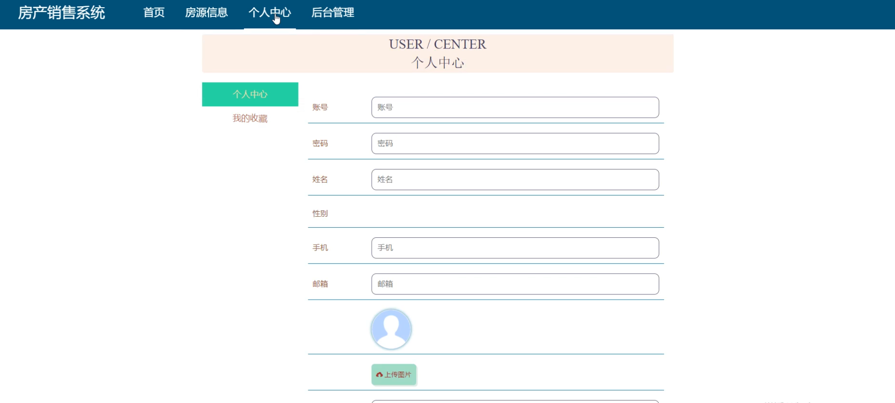
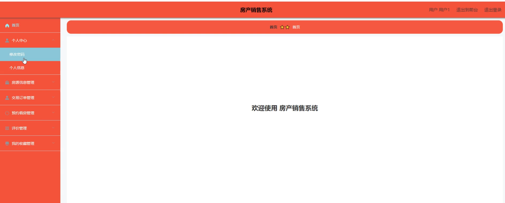
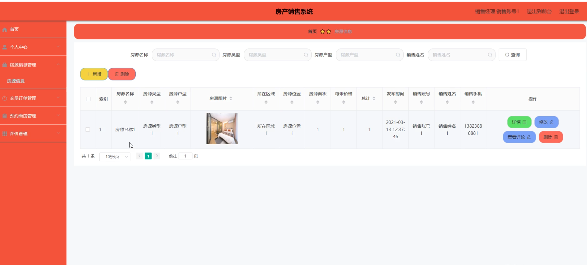
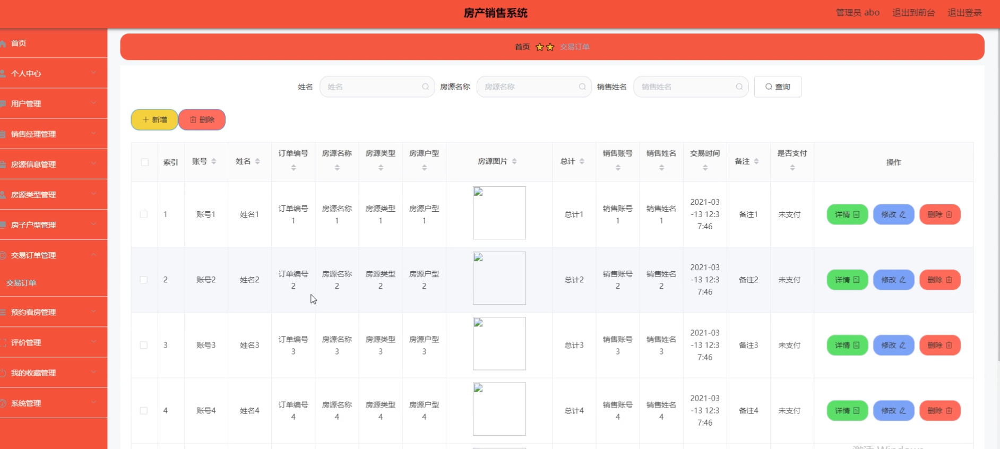

# 房产销售系统

#### 介绍
本系统是一款基于现代技术开发的房产销售系统，旨在提升房产销售的效率和用户体验。系统设计分为管理端、销售经理端和用户端三个角色，各角色拥有不同的功能模块，全面满足各类用户的需求。通过该平台，用户可以实现房源信息查看、预约看房、交易管理等多项功能，提升房产销售和管理的整体效能。

#### 技术栈介绍

后端技术栈：Springboot+Mysql+Maven

前端技术栈：Vue+Html+Css+Javascript+ElementUI

开发工具：Idea+Vscode+Navicate

#### 系统功能介绍

管理端功能模块

个人中心：管理员可以查看和修改个人信息，管理账户安全和偏好设置。

用户管理：管理员可以管理系统内所有用户的基本信息，确保用户数据的完整性和有效性。

销售经理管理：管理员可以管理平台内的销售经理信息，包括新增、删除和编辑销售经理信息。

房源信息管理：管理员可以新增、删除和编辑平台内的房源信息，维护房源数据库。

房源类型管理：管理员可以管理房源的分类，便于房源的分类管理和查询。

房子户型管理：管理员可以管理不同户型的房源信息，提供多样化的房源选择。

交易订单管理：管理员可以查看和管理平台内用户的交易订单信息，维护订单数据库。

预约看房管理：管理员可以管理用户的预约看房信息，确保预约流程的顺畅。

评价管理：管理员可以查看和管理用户对房源和服务的评价，提升服务质量。

我的收藏管理：管理员可以查看和管理平台内用户的收藏信息，提供收藏管理功能。

系统管理：管理员可以进行系统设置和维护，确保系统的正常运行和安全性。

销售经理端功能模块

个人中心：销售经理可以查看和修改个人信息，管理账户安全和偏好设置。

房源信息管理：销售经理可以新增、删除和编辑自己负责的房源信息，维护房源数据库。

交易订单管理：销售经理可以查看和管理自己负责的交易订单信息，确保交易流程的顺畅。

预约看房管理：销售经理可以管理用户的预约看房信息，确保预约流程的顺畅。

评价管理：销售经理可以查看和管理用户对房源和服务的评价，提升服务质量。

用户端功能模块

房源信息：用户可以查看平台内所有可选房源的信息，选择适合自己的房源进行购买。

个人中心：用户可以查看和修改个人信息，管理账户安全和偏好设置。

后台管理：
房源信息管理：用户可以查看和管理自己关注的房源信息。

交易订单管理：用户可以查看和管理自己的交易订单信息，确保订单信息的准确性和完整性。

预约看房管理：用户可以管理自己的预约看房信息，确保看房计划的顺畅进行。

评价管理：用户可以对房源和服务进行评价，帮助其他用户做出决策。

我的收藏管理：用户可以查看和管理自己的收藏信息，方便后续查看和购买。

#### 系统作用

对管理端的作用

高效的用户和销售经理管理：通过系统化的管理，管理员可以轻松维护用户和销售经理信息，提升管理效率。

全面的房源和订单管理：系统提供完善的房源信息和交易订单管理功能，确保房源和交易信息的准确性和及时更新。

便捷的预约和评价管理：管理员可以集中管理用户的预约看房和评价信息，提升服务质量。

对销售经理端的作用

便捷的房源和订单管理：销售经理可以轻松管理自己负责的房源和交易订单信息，确保信息的及时更新和交易的顺畅。

高效的预约和评价管理：销售经理可以管理用户的预约看房和评价信息，提升服务质量和用户满意度。

对用户端的作用

全面的房源信息：用户可以查看和选择适合自己的房源，提升房源选择的自主性和灵活性。

个性化的交易管理：用户可以通过后台管理功能，查看和管理自己的交易订单和预约信息，提升交易效率和体验。

便捷的收藏和评价功能：用户可以收藏自己感兴趣的房源，并对房源和服务进行评价，帮助其他用户做出决策。

#### 系统功能截图

代码结构

数据库表

登录

首页

房源信息

个人中心

后台管理

销售经理端

管理端

#### 总结

基于SpringBoot的房产销售系统通过信息化手段，实现了管理端、销售经理端和用户端的全面功能覆盖，满足了各类用户的需求。系统的高效、便捷、安全的特点，不仅提升了房产销售管理的效率和服务质量，还通过规范化的管理流程，确保了信息的准确性和透明度。未来，本系统将继续优化和扩展功能，为用户提供更优质的房产销售服务和体验。

#### 使用说明

创建数据库，执行数据库脚本 修改jdbc数据库连接参数 下载安装maven依赖jar 启动idea中的springboot项目

后台地址：http://localhost:8080/springbootbqv00/admin/dist/index.html

管理员  abo 密码 abo

前台地址：http://localhost:8080/springbootbqv00/front/index.html

